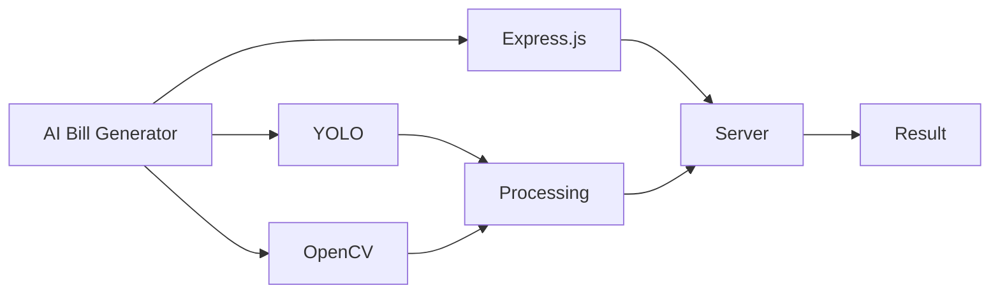
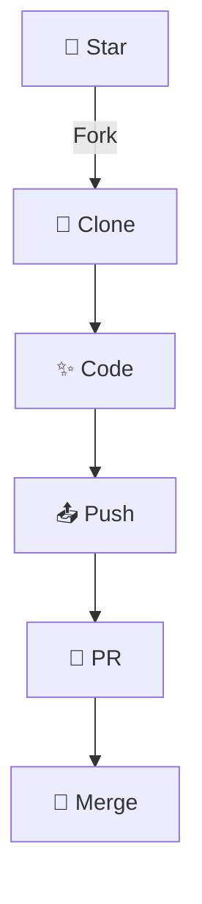

<div align="center">

```ascii
  █████╗ ██╗    ██████╗ ██╗██╗     ██╗     
 ██╔══██╗██║    ██╔══██╗██║██║     ██║     
 ███████║██║    ██████╔╝██║██║     ██║     
 ██╔══██║██║    ██╔══██╗██║██║     ██║     
 ██║  ██║██║    ██████╔╝██║███████╗███████╗
 ╚═╝  ╚═╝╚═╝    ╚═════╝ ╚═╝╚══════╝╚══════╝
```


</div>

<div align="center">

</div>

## 🎮 Interactive Features

<table>
<tr>
<td width="50%">

<br><b>Real-time Processing</b>
</td>
<td width="50%">

<br><b>Smart Analytics</b>
</td>
</tr>
</table>

## 🚀 Tech Wonderland

<div align="center">



</div>

## 🎯 Installation Magic

<div align="center">

```bash
# 🔮 Clone the Magic Repository
git clone https://github.com/zazbhai/AutoBill.git

# 🌟 Enter the Portal
cd AutoBill

# 🚀 Launch the Server
cd CheckoutUI/server && node server.js

# 🎯 Open the Gateway
# http://127.0.0.1:3000

# 🔥 Fire up the Engine
python3 test.py
```

</div>

## 🌈 Project Universe

```ascii
📦 AI-BILL-GENERATOR
 ┣ 🚀 CheckoutUI/
 ┃ ┣ 🎨 client/
 ┃ ┃ ┗ 📱 index.html
 ┃ ┗ ⚡ server/
 ┃   ┗ 🔥 server.js
 ┗ 🤖 test.py
```

## 🎨 Features Gallery

<div align="center">

| 🚀 Feature | ⭐ Description |
|------------|---------------|
| 🔍 Detection | Real-time bill scanning |
| 🤖 AI Processing | Smart data extraction |
| 📊 Analytics | Detailed insights |
| 🔄 Auto Sync | Cloud integration |
| 🔐 Security | Enterprise-grade |

</div>

## 🌟 Requirements

<div align="center">

```javascript
{
  "requirements": {
    "node": ">=14.0.0",
    "python": ">=3.8.0",
    "opencv": "latest",
    "ultralytics": "latest",
    "enthusiasm": "∞"
  }
}
```

</div>

## 🎮 Command Center

<div align="center">

```ascii
┌──────────────────────────────────┐
│    🚀 Server Status: Online      │
│    🌐 Port: 3000                 │
│    🔗 Host: localhost            │
│    ⚡ Protocol: http             │
└──────────────────────────────────┘
```

</div>

## 🌈 Contribution Galaxy

<div align="center">



</div>


<div align="center">

## 🌠 Connect with Creator

[](https://github.com/zazbhai)
[](https://t.me/Zazbhai)

</div>

<div align="center">


</div>
